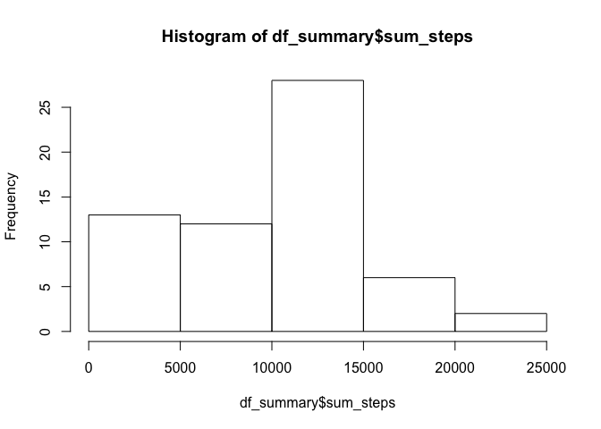
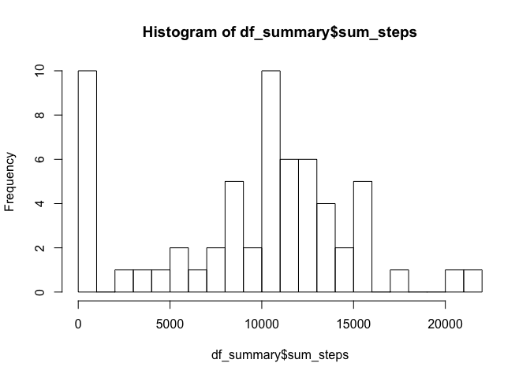
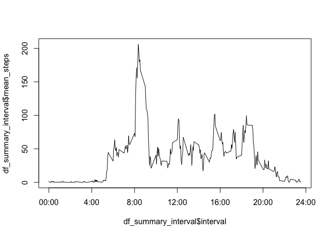
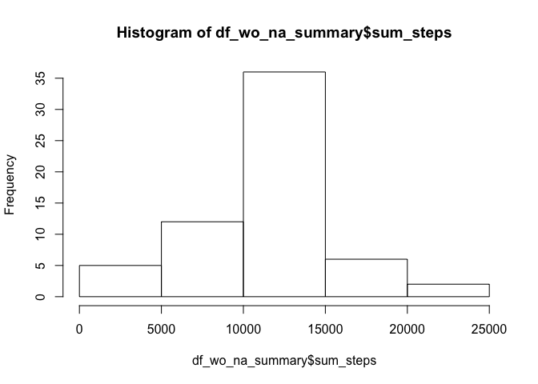
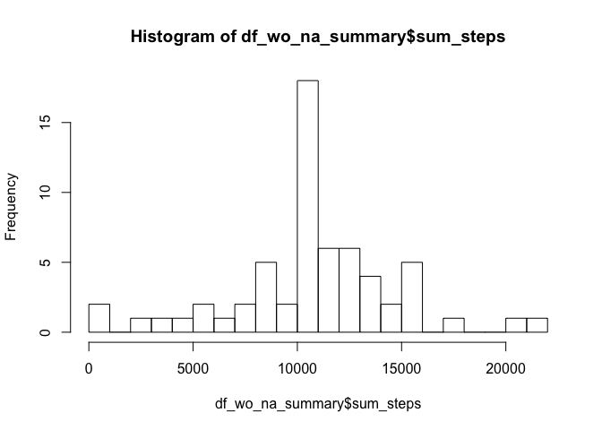
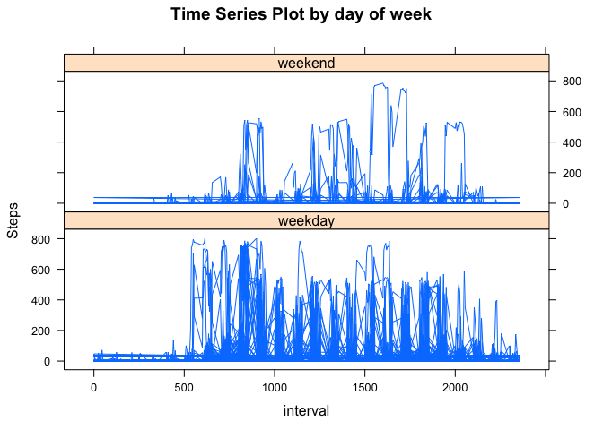

    # Load and process data
    #install.packages('dplyr')

    library(lattice) 
    library(dplyr)
    library(magrittr)

    # loading dataset
    df <- read.csv(file="activity.csv")

    # Take the summary, mean and median of unprocessed data 

    df_summary = df %>%
      group_by(date) %>%
      summarise(
        sum_steps = sum(steps, na.rm =  TRUE),
        mean_steps = mean(steps, na.rm =  TRUE),
        median_steps = median(steps, na.rm =  TRUE))

    # Histogram
    hist(df_summary$sum_steps)

    # Histogram with breaks for increased visibility

    hist(df_summary$sum_steps, breaks = 30)

    # display results

    print(df_summary)

    ## # A tibble: 61 x 4
    ##          date sum_steps mean_steps median_steps
    ##        <fctr>     <int>      <dbl>        <dbl>
    ##  1 2012-10-01         0        NaN           NA
    ##  2 2012-10-02       126    0.43750            0
    ##  3 2012-10-03     11352   39.41667            0
    ##  4 2012-10-04     12116   42.06944            0
    ##  5 2012-10-05     13294   46.15972            0
    ##  6 2012-10-06     15420   53.54167            0
    ##  7 2012-10-07     11015   38.24653            0
    ##  8 2012-10-08         0        NaN           NA
    ##  9 2012-10-09     12811   44.48264            0
    ## 10 2012-10-10      9900   34.37500            0
    ## # ... with 51 more rows

    # Time series for intervals

    df_summary_interval = df %>%
      group_by(interval) %>%
      summarise(
        total_steps = sum(steps, na.rm = TRUE),
        mean_steps = mean(steps, na.rm =  TRUE))

    plot(df_summary_interval$interval, df_summary_interval$mean_steps, type = "l", xaxt = "n")
    axis(side = 1, 
         at = c(0, 400, 800, 1200, 1600, 2000, 2400),
         labels = c("00:00", "4:00", "8:00", "12:00","16:00","20:00","24:00" ))

    # Max steps

    max_step = which.max(df_summary_interval$total_steps) %>% df_summary_interval$interval[.]
    print(max_step)

    ## [1] 835

    # Calculate and print # of NA's

    number_NA = is.na(df$steps) %>% sum
    print(number_NA)

    ## [1] 2304

    # Create a new dataset and that is a duplicate of df but replacing MA with the average number of steps

    df_wo_na <- df
    df_wo_na[is.na(df$steps), ]$steps <- mean(df$steps,na.rm = TRUE)

    # Take the summary, mean and median of processed data 

    df_wo_na_summary = df_wo_na %>%
      group_by(date) %>%
      summarise(
        sum_steps = sum(steps, na.rm =  TRUE),
        mean_steps = mean(steps, na.rm =  TRUE),
        median_steps = median(steps, na.rm =  TRUE))

    # Histogram
    hist(df_wo_na_summary$sum_steps)

    # Histogram with breaks for increased visibility

    hist(df_wo_na_summary$sum_steps, breaks = 30)

    # display results

    print(df_wo_na_summary)

    ## # A tibble: 61 x 4
    ##          date sum_steps mean_steps median_steps
    ##        <fctr>     <dbl>      <dbl>        <dbl>
    ##  1 2012-10-01  10766.19   37.38260      37.3826
    ##  2 2012-10-02    126.00    0.43750       0.0000
    ##  3 2012-10-03  11352.00   39.41667       0.0000
    ##  4 2012-10-04  12116.00   42.06944       0.0000
    ##  5 2012-10-05  13294.00   46.15972       0.0000
    ##  6 2012-10-06  15420.00   53.54167       0.0000
    ##  7 2012-10-07  11015.00   38.24653       0.0000
    ##  8 2012-10-08  10766.19   37.38260      37.3826
    ##  9 2012-10-09  12811.00   44.48264       0.0000
    ## 10 2012-10-10   9900.00   34.37500       0.0000
    ## # ... with 51 more rows

    #Extract weekends from weekdays

    # display results

    df_wo_na$day_of_week = ifelse(as.POSIXlt(as.Date(df_wo_na$date, format = "%Y-%m-%d"))$wday %in% 6:7, "weekend", "weekday")

    # kernel density plots by factor level 
    xyplot(df_wo_na$steps~df_wo_na$interval|df_wo_na$day_of_week, 
                main="Time Series Plot by day of week",
                xlab="interval",
                ylab="Steps",
                layout=c(1, 2),
           type='l')

